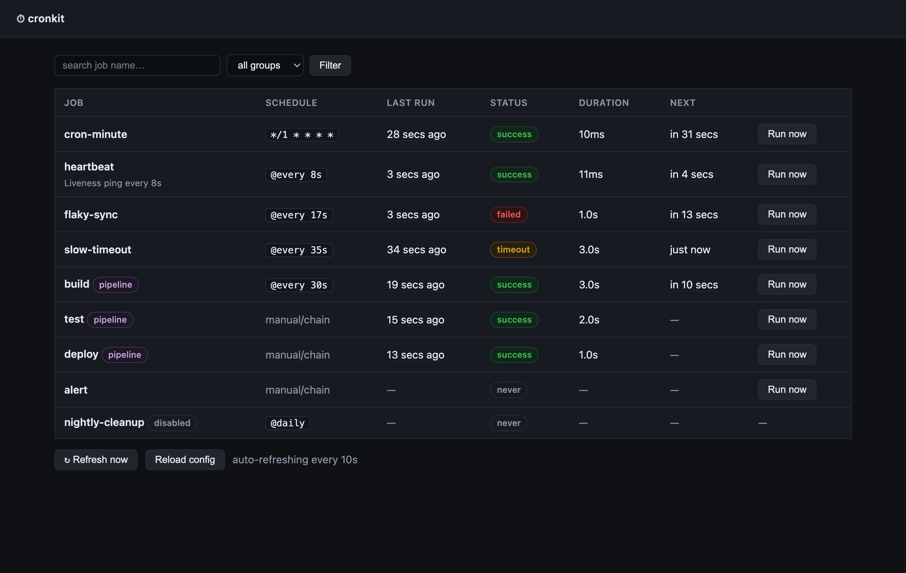
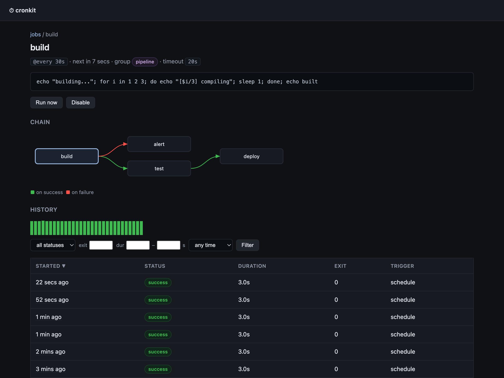
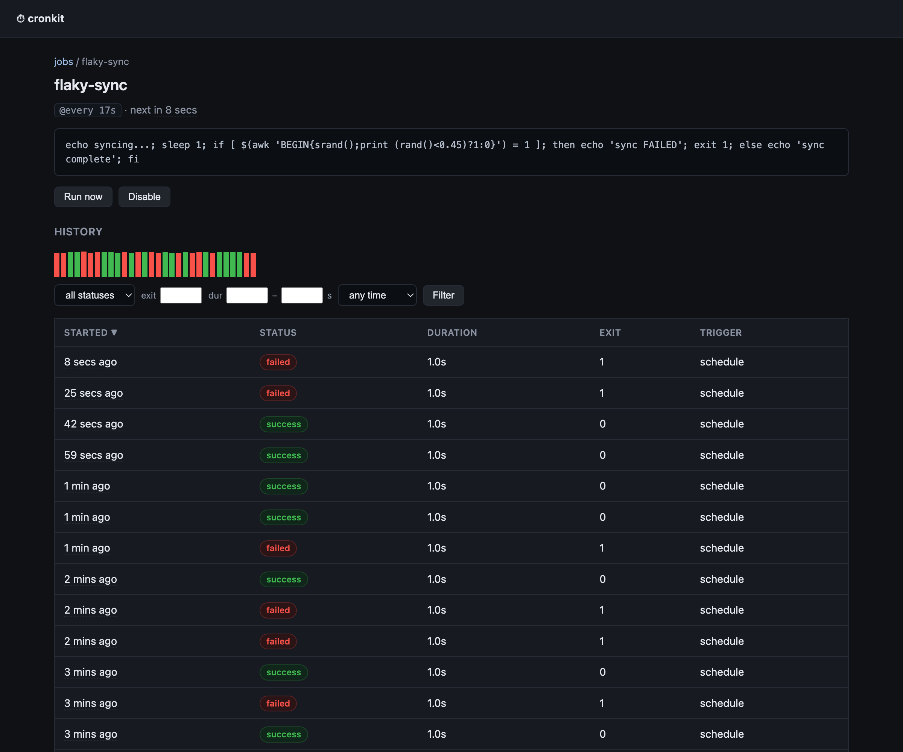
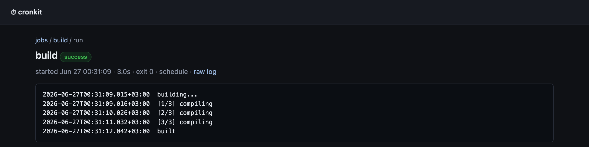

# cronkit

A deliberately small cron scheduler with a web UI and **per-execution logs**.
Runs shell commands on a schedule, captures each run's output, exit code and
duration to disk, and serves a tiny dashboard with a **live log tail**, a
sortable/filterable/paged **run history**, a duration chart, a chain graph, and
buttons to **run now**, **cancel** a running execution, and **disable/enable** a
job (disabled state persists to `<data>/state.json`).

No database. No clustering. No plugins. One static Go binary + a YAML file.

## Screenshots

| Dashboard | Job + chain graph |
|---|---|
| [](docs/screenshots/dashboard.png) | [](docs/screenshots/job-chain.png) |

| Run history (sortable / filterable / paged) | Run log (ISO-timestamped, live-tailed) |
|---|---|
| [](docs/screenshots/job-history.png) | [](docs/screenshots/run-log.png) |

## Why

It's the ~10% of a heavy scheduler (Cronicle/Airflow) that a single host
actually needs: see what's scheduled, trigger it, and read each run's log —
without a framework stack, a storage engine, or a user-management system.

## Config

Jobs are declared in a YAML file (`jobs.yml`), so they live in version control,
not a tool's database:

```yaml
timezone: America/New_York
keep_runs: 50
jobs:
  - name: kopia-watchdog
    schedule: "@hourly"          # cron expr or @descriptor
    command: "docker exec kopia kopia snapshot list --all"
    timeout: 10m                 # optional
  - name: btrfs-health
    schedule: "0 6 * * *"
    command: "/usr/local/bin/btrfs-health-check"
```

A job is `name` + `command`, plus an optional `schedule`. Schedule accepts
standard 5-field cron or `@hourly`/`@daily`/`@weekly`/`@every 30m`; **omit it**
for a job that only runs via chaining or "Run now". Commands run via `/bin/sh -c`.
`enabled: false` keeps a job in the file but unscheduled.

### Single-instance, groups, chaining

```yaml
jobs:
  - name: backup
    schedule: "0 3 * * *"
    group: storage          # group concurrency (see below)
    command: backup.sh
    on_success: [reindex]   # chaining: run reindex iff backup succeeds
    on_failure: [alert]     # run alert if backup fails/times out
  - name: reindex
    group: storage          # won't start while backup (same group) is running
    command: reindex.sh     # no schedule -> chain/manual only
```

- **Single-instance** (always on): a job never runs twice concurrently. A
  schedule tick or trigger that overlaps a running execution is **skipped**
  (`job already running`).
- **Groups** (`group:`): at most one job per group runs at a time. A run
  requested while the group is busy is **denied/skipped**, not queued.
- **Chaining** (`on_success` / `on_failure`): job names to trigger after this
  job finishes, in order. Chained jobs run under their own single-instance and
  group guards, and may chain further (cycle-guarded by a depth limit). Chained
  runs show `trigger: chain` in the history.

## Run

```sh
go build -o cronkit .
./cronkit -config jobs.yml -data ./data -addr :8080
```

Env vars (override flags): `CRONKIT_CONFIG`, `CRONKIT_DATA`, `CRONKIT_ADDR`.

### Docker

Pull the published multi-arch image (`linux/amd64`, `linux/arm64`) from Docker Hub
([`gretch/cronkit`](https://hub.docker.com/r/gretch/cronkit)):

```sh
docker run -d --name cronkit -p 8080:8080 \
  -v "$PWD/jobs.yml:/config/jobs.yml:ro" \
  -v cronkit-data:/data \
  -v /var/run/docker.sock:/var/run/docker.sock \   # only if jobs use `docker`
  gretch/cronkit:latest
```

Or build it yourself:

```sh
docker build -t cronkit .
docker run -d -p 8080:8080 \
  -v "$PWD/jobs.yml:/config/jobs.yml:ro" -v cronkit-data:/data cronkit
```

## Configuration

Global (top-level keys in `jobs.yml`):

| Key | Default | Description |
|---|---|---|
| `timezone` | `Local` | IANA tz for scheduling, the UI, and log timestamps |
| `keep_runs` | `50` | Global history cap — newest N runs kept per job |
| `max_log_bytes` | `20971520` (20 MiB) | Per-run `output.log` cap; a truncation notice is appended when hit |
| `notify` | — | Failure-email block (see below); omit to disable email |
| `jobs` | — | The list of jobs |

`notify` block:

| Key | Default | Description |
|---|---|---|
| `smtp_host` | — | SMTP relay host (required) |
| `smtp_port` | `25` | Relay port |
| `from` | — | Sender address (required) |
| `to` | — | Recipient list (required) |
| `on` | `[failed, timeout]` | Run statuses that trigger an email |

Per-job keys:

| Key | Required | Description |
|---|---|---|
| `name` | yes | Unique job name |
| `command` | yes | Shell command, run via `/bin/sh -c` |
| `schedule` | no | 5-field cron or `@hourly`/`@every 30m`; omit = manual/chain only |
| `timeout` | no | Go duration (e.g. `10m`); on expiry the whole process tree is killed |
| `enabled` | no (`true`) | `false` keeps the job in the file but unscheduled |
| `group` | no | Concurrency group — at most one job per group runs at a time |
| `on_success` | no | Jobs to trigger after this one succeeds |
| `on_failure` | no | Jobs to trigger after this one fails/times out |
| `description` | no | Free-text note shown in the UI |
| `notify` | no (`true`) | `false` suppresses failure email for this job |
| `keep_runs` | no | Per-job history cap (overrides global) |
| `keep_days` | no | Drop runs older than N days |

## How it works

- **Scheduling** is in-process ([robfig/cron]); a missed tick (host was down) is
  skipped, like cron — it does not catch up.
- **Each run** is a directory `<data>/<job>/<id>/` with `meta.json`
  (start/end/exit/status) and `output.log` (combined stdout+stderr, each line
  prefixed with an ISO-8601 timestamp of when cronkit received it).
- **Single-instance + group locking** are in-memory mutexes; a denied run is
  skipped, never queued.
- **Live tail** is Server-Sent Events tailing the active run's log file.
- History is pruned to `keep_runs` per job.

## Scope / non-goals

No auth (run it behind a reverse proxy on a trusted network — the run-now
endpoint executes your configured commands). No multi-server and no plugins.
Chaining is one-directional triggers (`on_success`/`on_failure`), not a full
dependency graph with fan-in/joins — if you need DAGs with joins or distributed
workers, you want Airflow or Cronicle.

[robfig/cron]: https://github.com/robfig/cron

## License

cronkit is licensed under the **PolyForm Noncommercial License 1.0.0**
([LICENSE.md](LICENSE.md)). You may use, modify, and share it for
**noncommercial** purposes (personal projects, research, hobby, nonprofits).

**Commercial use requires a separate license from the author** — open an issue
or contact [@doino-gretchenliev](https://github.com/doino-gretchenliev).

The software is provided **as is, without any warranty or condition**, and the
author has **no liability** for it or how it works (see the license's *No
Liability* section).
